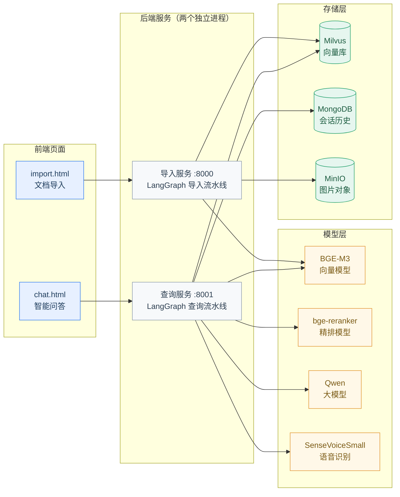
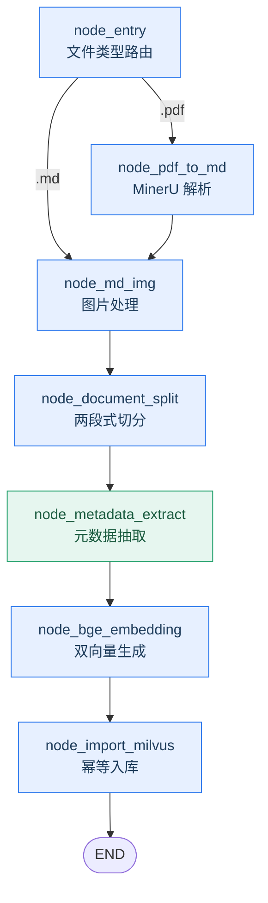
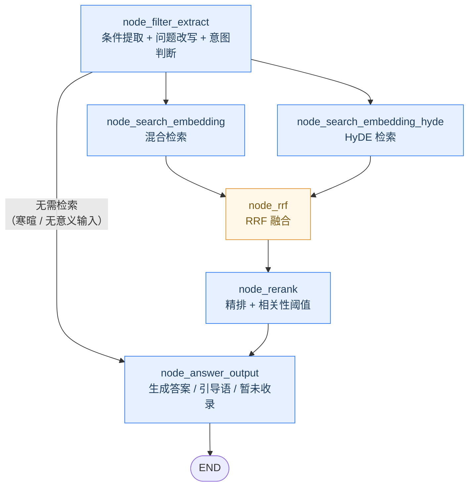

<div align="center">

# 育儿知识库

**面向家长端的家庭教育育儿助手 · 基于 RAG 的智能知识库系统**

[](https://www.python.org/)
[](https://fastapi.tiangolo.com/)
[](https://langchain-ai.github.io/langgraph/)
[](https://milvus.io/)
[](https://huggingface.co/BAAI/bge-m3)
[](https://github.com/FunAudioLLM/SenseVoice)
[](#)

系统接入**育儿建议、专家建议、亲子案例、沟通话术、知识科普**五类内容，提供育儿知识推荐、案例检索、问题问答与知识科普能力。

支持**多轮对话**、**流式输出**、**来源溯源**与**语音问答**。

</div>

---

## 目录

- [1. 功能特性](#1-功能特性)
- [2. 技术栈](#2-技术栈)
- [3. 系统架构](#3-系统架构)
- [4. 项目结构](#4-项目结构)
- [5. 快速开始](#5-快速开始)
- [6. 接口说明](#6-接口说明)
- [7. 流水线设计](#7-流水线设计)
- [8. 数据规范](#8-数据规范)
- [9. 向量库 Schema](#9-向量库-schema)
- [10. 关键设计说明](#10-关键设计说明)
- [11. 常见问题](#11-常见问题)
- [12. 后续扩展方向](#12-后续扩展方向)

---

## 1. 功能特性

| 能力 | 说明 |
| :--- | :--- |
| **内容导入** | 支持 PDF / Markdown；自动抽取元数据（内容类型 / 年龄段 / 问题类型 / 场景描述）；导入过程节点级进度追踪 |
| **混合检索** | BGE-M3 生成稠密 + 稀疏双向量，一次编码两种表示；按元数据条件过滤缩小检索范围 |
| **多路召回** | 常规语义检索 + HyDE 假设性文档检索，两路并行召回 |
| **结果融合** | RRF（Reciprocal Rank Fusion）融合多路结果，规避不同检索器分数量纲不可比的问题 |
| **结果精排** | bge-reranker-large 交叉编码器对候选切片精排，输出 Top-K |
| **知识问答** | 四段式回答：详细解释 → 方法建议 → 沟通话术 → 注意事项，并附来源溯源 |
| **意图分流** | 解析条件时同步判断"是否需要检索"；寒暄、无意义输入（如「你好」「1」）直接给引导语，不触发检索 |
| **相关性阈值** | 精排分数低于阈值视为不相关直接丢弃；全部被丢弃时明确回「暂未收录」，避免"问什么都强行编一段答案" |
| **语音问答** | SenseVoiceSmall 本地识别：浏览器直录 16 kHz WAV → 后端识别 → 自动发送，全程只需点一次麦克风 |
| **交互能力** | 单轮问答、多轮对话（指代消解）、SSE 流式输出、历史记录管理 |
| **健壮性** | 无条件召回兜底、精排失败降级、元数据 LLM 兜底、导入幂等（同文档重导即替换） |

---

## 2. 技术栈

| 层级 | 选型 | 用途 |
| :--- | :--- | :--- |
| Web 框架 | FastAPI + Uvicorn | 提供 REST 接口与 SSE 流 |
| 流程编排 | LangGraph（StateGraph） | 编排两条 RAG 流水线 |
| 向量模型 | `BAAI/bge-m3` | 稠密 + 稀疏双向量生成 |
| 精排模型 | `BAAI/bge-reranker-large` | 交叉编码器精排 |
| 向量数据库 | Milvus | HNSW + SPARSE_INVERTED_INDEX 混合检索 |
| 会话存储 | MongoDB | 多轮对话历史 |
| 对象存储 | MinIO | 存放 PDF 解析出的图片 |
| 文档解析 | MinerU | PDF → Markdown |
| 语音识别 | `iic/SenseVoiceSmall`（FunASR） | 语音转文字（CPU 实时率约 0.07） |
| 大模型 | 通义千问（OpenAI 兼容接口） | 条件抽取 / 意图判断 / HyDE / 答案生成 |
| 日志 | loguru | 控制台 + 文件双输出 |
| 依赖管理 | uv | 环境与依赖 |

---

## 3. 系统架构



> **设计要点**：导入与查询拆成两个独立进程，分别占用 `8000` / `8001` 端口。导入是重计算任务、查询是低延迟任务，两者资源特征不同，拆开后可以独立重启与扩容。

---

## 4. 项目结构

```
parenting-kb/
├── .env.example                 # 环境变量模板（复制为 .env 后填写）
├── pyproject.toml               # 依赖声明
├── prompts/                     # 提示词模板
│   ├── metadata_extract.prompt  # 元数据抽取（LLM 兜底）
│   ├── filter_extract.prompt    # 检索条件提取 + 问题改写 + 意图判断
│   ├── hyde_prompt.prompt       # 假设性文档生成
│   ├── answer_out.prompt        # 四段式答案生成
│   └── image_summary.prompt     # 图片摘要（PDF 用）
├── doc/                         # 待导入的原始素材（自行放入）
├── logs/                        # 运行日志（自动生成）
├── output/                      # 导入产物：解析结果 / 切片备份 backup.json
└── app/
    ├── conf/                    # 配置层
    │   ├── domain_config.py     # 领域常量（字段名 / 白名单）—— 唯一数据源
    │   ├── lm_config.py         # 大模型配置
    │   ├── embedding_config.py  # 向量模型配置
    │   ├── reranker_config.py   # 精排模型配置
    │   ├── asr_config.py        # 语音识别模型配置
    │   ├── milvus_config.py     # Milvus 配置
    │   ├── minio_config.py      # MinIO 配置
    │   └── mineru_config.py     # MinerU 配置
    ├── core/                    # 框架基础设施
    │   ├── logger.py            # 日志 + @node_log / @step_log 埋点装饰器
    │   └── load_prompt.py       # 提示词加载与变量渲染
    ├── clients/                 # 外部存储客户端
    │   ├── milvus_utils.py      # 混合检索 / 按主键补全切片
    │   ├── minio_utils.py       # 图片上传与桶策略
    │   └── mongo_history_utils.py  # 会话历史读写
    ├── lm/                      # 模型封装（均为单例）
    │   ├── lm_utils.py          # ChatOpenAI 客户端（带缓存）
    │   ├── embedding_utils.py   # BGE-M3 双向量生成
    │   ├── reranker_utils.py    # 精排模型
    │   └── asr_utils.py         # SenseVoiceSmall 语音识别
    ├── utils/                   # 通用工具
    │   ├── path_util.py         # 项目根目录定位
    │   ├── sse_utils.py         # SSE 队列与事件
    │   ├── task_utils.py        # 内存态任务进度追踪
    │   ├── milvus_hit_utils.py  # 检索结果拍平与去重
    │   ├── escape_milvus_string_utils.py  # 过滤表达式转义
    │   └── rate_limit_utils.py  # 第三方 API 滑动窗口限流
    ├── tool/                    # 模型下载脚本
    ├── import_process/          # 【导入服务】端口 8000
    │   ├── agent/
    │   │   ├── main_graph.py    # 流水线编排
    │   │   ├── state.py         # 状态定义
    │   │   └── nodes/           # 7 个处理节点
    │   ├── api/file_import_service.py
    │   └── page/import.html     # 上传页面
    └── query_process/           # 【查询服务】端口 8001
        ├── agent/
        │   ├── main_graph.py    # 流水线编排
        │   ├── state.py         # 状态定义
        │   ├── filters.py       # 条件 → Milvus 过滤表达式
        │   └── nodes/           # 6 个处理节点
        ├── api/query_service.py
        └── page/chat.html       # 对话页面
```

---

## 5. 快速开始

### 5.1 环境要求

| 依赖 | 版本 / 说明 |
| :--- | :--- |
| Python | ≥ 3.11 |
| Milvus | ≥ 2.4（查询侧用到 `like` 语法） |
| MongoDB | 用于会话历史 |
| MinIO | 用于图片对象存储 |
| 本地模型 | `BAAI/bge-m3`、`BAAI/bge-reranker-large`、`iic/SenseVoiceSmall` |
| 大模型 API | 通义千问（百炼）API Key |

模型缺失时可用脚本下载：

```bash
# 向量模型与精排模型
uv run python app/tool/download_bgem3.py
uv run python app/tool/download_reranker.py

# 语音识别模型（modelscope 直连，无需镜像）
uv run python -c "from modelscope.hub.snapshot_download import snapshot_download; print(snapshot_download('iic/SenseVoiceSmall', cache_dir='D:/ai_models/modelscope_cache/models'))"
```

> [!NOTE]
> 语音识别依赖 `funasr` + `kaldi-native-fbank`（用于 fbank 特征提取）。若报 `ImportError: torchaudio is not installed and neither is the kaldi-native-fbank backend`，执行 `uv add kaldi-native-fbank` 即可（体积约 1 MB，不会牵动 torch 版本）。

### 5.2 安装依赖

```bash
uv sync
```

### 5.3 配置环境变量

```bash
cp .env.example .env          # Windows: Copy-Item .env.example .env
```

关键配置项：

| 变量 | 说明 |
| :--- | :--- |
| `OPENAI_API_KEY` / `OPENAI_BASE_URL` | 大模型接口（OpenAI 兼容） |
| `LLM_DEFAULT_MODEL` / `VL_MODEL` | 对话模型 / 视觉模型 |
| `BGE_M3_PATH` | BGE-M3 本地模型路径 |
| `BGE_DEVICE` / `BGE_FP16` | 向量模型设备（`cpu` / `cuda:0`）与半精度 |
| `BGE_RERANKER_LARGE` / `BGE_RERANKER_DEVICE` | 精排模型路径与设备 |
| `MILVUS_URL` / `CHUNKS_COLLECTION` | Milvus 地址与切片集合名 |
| `MONGO_URL` / `MONGO_DB_NAME` | 会话历史存储 |
| `MINIO_*` | 图片对象存储 |
| `MINERU_BASE_URL` / `MINERU_API_TOKEN` | PDF 解析服务 |
| `ASR_MODEL_PATH` / `ASR_DEVICE` | 语音识别模型路径与设备（`cpu`） |
| `MIN_RERANK_SCORE` / `MIN_DISTANCE_SCORE` | 检索相关性阈值（详见 [10.8](#108-相关性阈值)） |

> [!IMPORTANT]
> `CHUNKS_COLLECTION` 用于隔离不同知识库。同一 Milvus 实例上运行多个项目时，务必使用不同的集合名，否则会因 schema 不匹配导致插入失败或数据互相污染。

### 5.4 启动服务

导入服务与查询服务是**两个独立的进程**，需要**两个终端**分别启动。

```bash
# 终端 1：导入服务（8000）
uv run uvicorn app.import_process.api.file_import_service:app --host 127.0.0.1 --port 8000 --reload

# 终端 2：查询服务（8001）
uv run uvicorn app.query_process.api.query_service:app --host 127.0.0.1 --port 8001 --reload
```

> [!TIP]
> 不要用 IDE 的「运行」按钮启动 —— 它会复用当前活动终端，导致第二个服务无法启动。请在新建的终端里手敲命令，或用 `Start-Process powershell` 弹独立窗口。

### 5.5 导入文档

1. 打开 `http://127.0.0.1:8000/import.html`
2. 拖入或选择 `.md` / `.pdf` 文件（支持一次多选批量上传）
3. 页面实时展示每个文件的处理进度与所在节点
4. 访问 `http://127.0.0.1:8000/stats` 查看向量库当前数据量

> [!NOTE]
> 首次导入会加载 BGE-M3 模型，第一篇约需 30~60 秒，属正常现象。CPU 环境下建议分批导入（每批 3~5 篇）。

### 5.6 开始问答

打开 `http://127.0.0.1:8001/chat.html`，输入育儿问题即可。

| 页面能力 | 说明 |
| :--- | :--- |
| 流程可视化 | 实时展示「解析条件 → 双路检索 → 融合 → 精排 → 生成」进度 |
| 流式输出 | 逐字返回，首字延迟低 |
| 语音输入 | 点麦克风说话，静音 1.5 秒自动结束并直接发送，无需再点「发送」 |
| 消息操作 | 复制答案 / 重新生成 / 停止生成 |
| 历史管理 | 刷新自动恢复历史对话，支持一键清空会话 |

#### 5.6.1 语音问答使用说明

| 项 | 说明 |
| :--- | :--- |
| 使用前提 | 必须通过 `http://127.0.0.1:8001/chat.html` 访问（用 `file://` 打开拿不到麦克风权限） |
| 浏览器 | Chrome / Edge |
| 交互流程 | 点 🎤 → 说话 → 停顿 1.5 秒自动结束 → 用户气泡先出现（三个跳动的点）→ 识别完自动发送 |
| 首次使用 | 会弹出麦克风授权；首次识别需要加载模型约 20 秒，**建议先预热** |

```bash
# 预热语音模型，避免第一次说话干等 20 秒
curl.exe -X POST "http://127.0.0.1:8001/asr" -F "file=@D:/ai_models/SenseVoiceSmall/example/zh.mp3"
```

> [!TIP]
> 录音在前端直接生成 **16 kHz 单声道 WAV**（Web Audio API 采样 + 手写 WAV 头），**不依赖 ffmpeg、服务端也不做转码**。原因是 funasr 的解码后端只保证支持 WAV / MP3 / FLAC，而浏览器 `MediaRecorder` 默认输出的 WebM 容器读不了；直接按 16 kHz 录制又正好是 SenseVoice 需要的输入采样率。

---

## 6. 接口说明

### 6.1 导入服务（:8000）

| 方法 | 路径 | 说明 |
| :--- | :--- | :--- |
| `GET` | `/import.html` | 上传页面 |
| `POST` | `/upload` | 上传文件（`files` 字段，支持多文件），返回 `task_ids` |
| `GET` | `/status/{task_id}` | 查询任务进度（`status` / `running_list` / `done_list`） |
| `GET` | `/stats` | 查看向量库数据量 |

### 6.2 查询服务（:8001）

| 方法 | 路径 | 说明 |
| :--- | :--- | :--- |
| `GET` | `/chat.html` | 对话页面 |
| `POST` | `/query` | 提问，入参 `{query, session_id, is_stream}` |
| `POST` | `/asr` | 语音转文字：`multipart/form-data` 上传音频（`file` 字段，建议 `.wav`），返回 `{text}` |
| `GET` | `/stream/{session_id}` | SSE 流式输出 |
| `GET` | `/history/{session_id}` | 查询最近历史对话 |
| `DELETE` | `/delete/{session_id}` | 清空会话历史 |
| `GET` | `/health` | 健康检查 |

**SSE 事件类型**

| 事件 | 载荷 | 说明 |
| :--- | :--- | :--- |
| `ready` | `{}` | 连接建立 |
| `progress` | `{status, done_list, running_list}` | 节点进度 |
| `delta` | `{delta}` | 答案增量片段 |
| `final` | `{answer}` | 完整答案 |
| `error` | `{error}` | 错误信息 |

---

## 7. 流水线设计

### 7.1 导入流水线



| 节点 | 职责 |
| :--- | :--- |
| `node_entry` | 判断文件类型（PDF / MD），确定路由分支，提取文件标题与原始文件名 |
| `node_pdf_to_md` | 调用 MinerU 在线 API 将 PDF 解析为 Markdown |
| `node_md_img` | 扫描 md 内图片，调用视觉模型生成摘要，上传 MinIO 并替换链接；**无图时直接透传** |
| `node_document_split` | 按 Markdown 标题初切 + 超长段落二次切分，结果备份到 `backup.json` |
| `node_metadata_extract` | 正则解析 `## 元数据` 段，缺失时 LLM 兜底，并把元数据绑定到每个切片 |
| `node_bge_embedding` | 用 BGE-M3 为每个切片生成稠密 + 稀疏向量 |
| `node_import_milvus` | 按 schema 建集合，按来源文件删除旧数据（幂等），批量插入 |

### 7.2 查询流水线



| 节点 | 职责 |
| :--- | :--- |
| `node_filter_extract` | 结合历史做指代消解，抽取检索条件并改写问题，**同步判断是否需要检索**；不需要时直接产出引导语并跳过后续检索；落库用户消息 |
| `node_search_embedding` | 用改写后的问题做混合检索，带元数据过滤；无命中时自动退化为全库检索 |
| `node_search_embedding_hyde` | 先让 LLM 生成假设性答案，再据此检索，提升口语化提问的召回率 |
| `node_rrf` | 按 RRF（k=60）融合两路结果，按 `chunk_id` 去重 |
| `node_rerank` | bge-reranker-large 对候选逐对打分排序，**按相关性阈值过滤**后输出 Top-5；模型不可用时降级为 Milvus 分数过滤 |
| `node_answer_output` | 组装带来源的上下文，生成四段式答案；三种出口：正常答案 / 引导语 / 「暂未收录」兜底；流式推送并落库 |

### 7.3 关键参数

| 参数 | 取值 | 位置 |
| :--- | :--- | :--- |
| 切片长度 / 重叠 | `500 / 50` | `node_document_split.py` |
| 向量化批大小 | `5` | `node_bge_embedding.py` |
| 混合检索权重（稠密, 稀疏） | `(0.8, 0.2)` | `node_search_embedding*.py` |
| 单路召回 / 融合返回 | `10 / 5` | 同上 |
| RRF 平滑常数 k | `60` | `node_rrf.py` |
| 精排候选 / 最终 Top-K | `20 / 5` | `node_rerank.py` |
| 精排相关性阈值 | `0.3`（`.env`: `MIN_RERANK_SCORE`） | `node_rerank.py` |
| 精排降级兜底阈值 | `0.3`（`.env`: `MIN_DISTANCE_SCORE`） | `node_rerank.py` |
| 语音采样率 / 编码 | `16 kHz / 单声道 PCM WAV` | `chat.html` |
| 静音自动结束 | `1.5 s` | `chat.html` |

---

## 8. 数据规范

知识库中每篇文档建议在头部包含 `## 元数据` 段：

```markdown
# 3-6岁情绪管理与规则建立建议
## 元数据
- 内容类型：专家建议
- 年龄段：3-6岁
- 问题类型：情绪管理 / 行为引导 / 亲子沟通
- 场景描述：发脾气、不肯合作、规则执行困难、公共场所失控

## 核心观点
...
```

字段约束（定义在 `app/conf/domain_config.py`）：

| 字段 | 中文名 | 取值 |
| :--- | :--- | :--- |
| `content_type` | 内容类型 | 育儿建议 / 专家建议 / 亲子案例 / 沟通话术 / 知识科普 |
| `age_range` | 年龄段 | 0-3岁 / 3-6岁 / 6-12岁 / 12+岁（可多值） |
| `problem_type` | 问题类型 | 情绪管理 / 行为引导 / 学习能力 / 社交能力 / 亲子沟通 等（可多值） |
| `scene` | 场景描述 | 自由文本，多值以顿号或斜杠分隔 |

<details>
<summary><b>多值字段的处理规则（点击展开）</b></summary>

多值字段在入库前会被规范化为**英文逗号拼接**：

```
"3-6岁 / 6-12岁"  →  "3-6岁,6-12岁"
```

检索时用 `like "%3-6岁%"` 做包含匹配，同字段内多值取 `or`、不同字段间取 `and`：

```sql
(age_range like "%3-6岁%" or age_range like "%6-12岁%")
  and problem_type like "%情绪管理%"
```

</details>

---

## 9. 向量库 Schema

<details>
<summary><b>集合 kb_parenting_chunks 的完整字段定义（点击展开）</b></summary>

| 字段 | 类型 | 说明 |
| :--- | :--- | :--- |
| `chunk_id` | `INT64` | 主键（自增） |
| `file_title` | `VARCHAR` | 来源文件名（去后缀） |
| `source_file` | `VARCHAR` | 来源文件名（含后缀），幂等删除依据 |
| `source_path` | `VARCHAR` | 来源路径 |
| `content_type` | `VARCHAR` | 内容类型 |
| `age_range` | `VARCHAR` | 年龄段（逗号拼接） |
| `problem_type` | `VARCHAR` | 问题类型（逗号拼接） |
| `scene` | `VARCHAR` | 场景描述（逗号拼接） |
| `title` | `VARCHAR` | 切片标题 |
| `parent_title` | `VARCHAR` | 所属章节标题 |
| `part` | `INT8` | 切片在同章节内的序号 |
| `author` | `VARCHAR` | 作者 |
| `content` | `VARCHAR` | 切片正文 |
| `dense_vector` | `FLOAT_VECTOR(1024)` | 稠密向量 · HNSW / COSINE（M=32, efConstruction=300） |
| `sparse_vector` | `SPARSE_FLOAT_VECTOR` | 稀疏向量 · SPARSE_INVERTED_INDEX / IP |

</details>

> 所有标量字段名统一由 `app/conf/domain_config.py` 的 `CHUNK_SCALAR_FIELDS` 定义，建表与插入共用同一份列表，从根本上避免两侧字段名不一致。

---

## 10. 关键设计说明

### 10.1 元数据"正则优先 + LLM 兜底"

素材头部已带规范的元数据段，正则解析**准确率 100% 且零成本**；仅在完全解析不到时才调用大模型。把成本花在真正需要的文档上。

### 10.2 向量化文本注入元数据

切片向量化时使用如下模板作为输入：

```
【内容类型】【年龄段】切片标题：正文
```

让「3-6岁」「情绪管理」这类条件词也参与语义召回，而不仅仅依赖正文相似度。

### 10.3 两级召回兜底

带条件检索无命中时，**自动去掉过滤条件重查一次**，避免"条件写得太细导致答不出来"。

### 10.4 RRF 融合

只看排名不看绝对分数，规避两路检索器分数量纲不可比的问题：

```
score(d) = Σ 1 / (k + rank_i(d))        k = 60
```

### 10.5 全链路降级

| 环节 | 失败时 |
| :--- | :--- |
| HyDE 文档生成 | 退化为普通向量检索 |
| 精排模型 | 降级使用 RRF 排序结果 |
| 流式生成中断 | 降级为一次性生成 |
| 元数据正则解析 | 调用 LLM 兜底 |

### 10.6 幂等导入

同一份文档重复导入时，先按 `source_file` 删除旧切片再插入，保证是"替换"而非"追加"。

### 10.7 意图分流（拦截寒暄与无意义输入）

向量检索的本质是"**找最像的**"而不是"**找够像的**" —— 库里只要有数据，任何输入都能召回 Top-K。因此若不拦截，「你好」「1」这类输入也会走完整条检索链路，并被大模型"硬凑"出一段育儿建议。

解决方式是在检索之前先分流：条件抽取时同步输出 `need_retrieval`，为 `false` 时直接生成一句引导语并跳过检索。

判断标准是「**用户这句话本身是否携带了有效信息**」，而不是"是否在承接上文" —— 否则孤立的「1」会因为前文聊过育儿而被判定成有效追问（这是实测踩过的坑：LLM 把「1」改写成了"3-6岁孩子在打篮球时因输赢而发脾气…"，从而命中高分）。

| 输入 | 判定 | 说明 |
| :--- | :--- | :--- |
| 「3-6岁孩子挑食怎么办」 | 需要检索 | 正常链路 |
| 「那6-12岁呢」 | 需要检索 | 承接上文但携带了新信息（年龄段） |
| 「你好」「1」「测试」 | 不需要检索 | 约 1 秒返回（省去 HyDE + 精排 + 生成） |

> 分流复用了图中已有的条件边 —— 上游只要产出 `answer`，图就自动跳过检索直达答案输出节点，无需新增分支结构。

### 10.8 相关性阈值

精排的交叉编码器输出的是"问题与切片是否真的相关"的判断，因此加一道阈值过滤：低于阈值直接丢弃。

关键在于**阈值过滤与下游"检索结果为空"的兜底形成联动**：

```
精排分数全部低于阈值 → reranked_docs 为空 → node_answer_output 走「暂未收录」分支
```

下游一行都不用改，只是换了个判空条件。同时精排不可用时降级为 Milvus 归一化分数过滤，保证"模型加载失败"也不会退化成"问什么都答"。

**阈值必须实测标定** —— 每次精排都会打印一行分数分布，分别问一个正常育儿问题和一个「你好」，取两者之间的空档作为阈值：

```
[精排] 分数分布：0.867 | 0.789 | 0.412 | 0.339 | 0.256 | 0.167 | 0.101
```

### 10.9 语音输入直接录制 16 kHz WAV

浏览器 `MediaRecorder` 的默认输出是 **WebM 容器**，而 funasr 的解码后端（`soundfile` / `torchaudio`）只保证支持 WAV / MP3 / FLAC，读 WebM 需要额外安装 ffmpeg。

因此改为用 **Web Audio API 直接采集 PCM**，在前端手写 WAV 头并编码为 16 bit 单声道 WAV：

- 采样率直接指定 `16 kHz` —— 正好是 SenseVoice 的输入要求，**服务端零转码**
- 无需安装 ffmpeg，也不引入服务端转码依赖
- 体积可控：16 kHz / 16 bit / 单声道 ≈ 32 KB/s

另外做了"**感知加速**"：录音结束后立刻把一个用户气泡（三个跳动的点）放进聊天区，识别在后台静默进行，识别完再把占位替换成文字并自动发送。用户感知到的等待只剩检索耗时，识别耗时被藏进了"消息已发出"的反馈里。

> 注意：气泡占位与自动发送需要 `send(question, userBubble)` 支持复用已有气泡，否则会出现两条用户消息。

---

## 11. 常见问题

<details>
<summary><b>Q：为什么导入服务与查询服务要分两个端口？</b></summary>

两条链路的资源占用与生命周期不同：导入是重计算任务（向量化耗时），查询是低延迟任务。拆成两个进程后可以独立重启、独立扩容，导入服务挂了也不影响线上问答。

</details>

<details>
<summary><b>Q：启动报 <code>FileNotFoundError: 未找到项目根目录标识「.env」</code>？</b></summary>

`app/utils/path_util.py` 以 `.env` 作为项目根目录的标识文件。请确认 `.env` 已创建在项目根目录（从 `.env.example` 复制）。

</details>

<details>
<summary><b>Q：导入时日志停在"开始为 N 条文本生成混合向量嵌入"很久不动？</b></summary>

BGE-M3 正在 CPU 上编码，属正常现象（该步骤内部无中间日志）。可打开任务管理器确认 python 进程的 CPU 占用：

- CPU 占用高 → 正在计算，继续等待
- CPU 接近 0 且内存不动 → 检查是否内存不足（BGE-M3 fp32 约占 2~3 GB）

启用 GPU 可显著加速：`.env` 中设置 `BGE_DEVICE=cuda:0`、`BGE_FP16=1`。

</details>

<details>
<summary><b>Q：查询总是返回"知识库中暂未收录相关内容"？</b></summary>

按顺序排查：

1. 访问 `http://127.0.0.1:8000/stats`，确认 `row_count > 0`（数据是否真的入库）
2. 查看日志中 `node_rerank` 输出的 Top-5 命中，判断是检索质量问题还是知识库确实没有该内容
3. 检查 `.env` 的 `CHUNKS_COLLECTION` 与导入时使用的是否一致

</details>

<details>
<summary><b>Q：流式接口无输出或报错？</b></summary>

`POST /query` 必须带 `is_stream: true`，服务端才会创建 SSE 队列；随后前端通过 `GET /stream/{session_id}` 建立连接。若用 `/docs` 手动测试，注意两者要配合使用。

</details>

<details>
<summary><b>Q：同一个 Milvus 实例上能跑多个知识库吗？</b></summary>

可以。通过 `.env` 的 `CHUNKS_COLLECTION` 指定不同集合名即可隔离。**不要复用已有集合**——若同名集合已存在，代码会跳过建表，导致新旧 schema 不匹配。

</details>

<details>
<summary><b>Q：问「你好」或随便发一个「1」，系统也会长篇大论地回答？</b></summary>

按顺序排查：

1. **服务没重启** —— `.env` 与 `.prompt` 的改动**不会触发 `--reload`**（它只监控 `.py` 文件），改完必须手动重启查询服务
2. **阈值偏低** —— 查看日志里的 `[精排] 分数分布`，若无关内容的分数也在阈值以上，把 `MIN_RERANK_SCORE` 调高
3. **意图分流是否生效** —— 日志里应出现 `需要检索=False`；若始终为 `True`，检查提示词是否已更新（同上，改完 prompt 要重启）

</details>

<details>
<summary><b>Q：语音识别报 <code>not enough memory</code> 或 <code>os error 1455（页面文件太小）</code>？</b></summary>

这两个都是**内存 / 虚拟内存耗尽**，不是代码问题。查询服务同时驻留三个模型：BGE-M3 约 2.3 GB + bge-reranker-large 约 1.3 GB + SenseVoiceSmall 约 1.5 GB。

排查顺序：

1. 看物理内存与提交内存（虚拟内存）余量
2. 关闭同类占用程序（IDE、浏览器多余标签页等）
3. 内存确实不足时，可把语音识别拆成独立进程，不用时直接关掉

> [!WARNING]
> 模型是**按进程**加载的。单独跑测试脚本同样会占一份内存，**不要与查询服务同时运行**，否则两份叠加更容易触发 OOM。

</details>

<details>
<summary><b>Q：第一次语音识别要等 20 多秒？</b></summary>

模型采用**懒加载**（第一次调用 `/asr` 才载入），CPU 上约 20 秒。演示或测试前先用 [5.6.1](#561-语音问答使用说明) 里的 `curl` 命令预热一次即可。

预热后单次识别约 1 秒（实测 5.6 秒音频耗时 0.406 秒，实时率约 0.07）。

</details>

</details>

---

## 12. 后续扩展方向

- 内容后台管理与知识库管理页面
- 文档增量更新（按变更检测触发重导入）
- 权限控制与多租户支持
- **个性化推荐与亲子画像**：把散落在多轮对话里的孩子特征沉淀成结构化档案（年龄段 / 性格特点 / 家长关注点），再用画像做"检索条件兜底"与"主动推荐"
- **情感识别与高风险信号预警**：SenseVoiceSmall 的原始输出已带情绪标签（`<|ANGRY|>` 等），当前被后处理清洗掉了，稍作解析即可支撑"先共情再给方法"与风险提示
- 对话结果返回知识卡片结构（前端卡片化渲染）

> 语音交互与多轮对话能力已落地，详见 [5.6.1 语音问答使用说明](#561-语音问答使用说明) 与 [10.7 意图分流](#107-意图分流拦截寒暄与无意义输入)。

---

<div align="center">

**育儿知识库** · 基于 FastAPI + LangGraph + Milvus 的 RAG 实践

</div>
